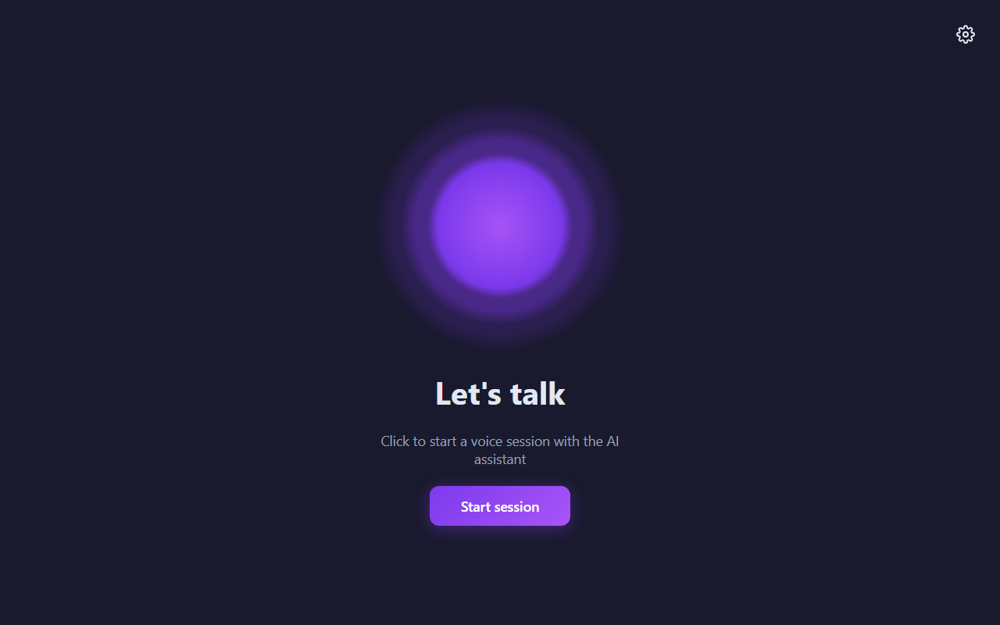
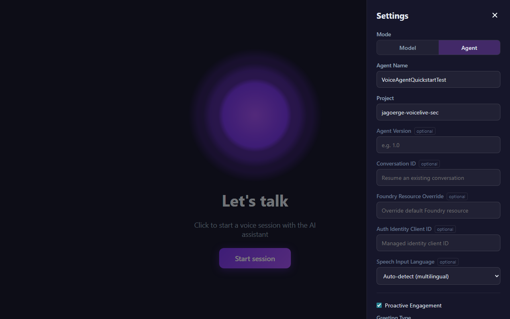
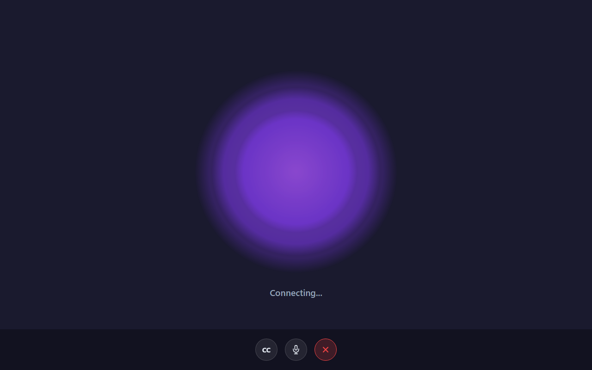
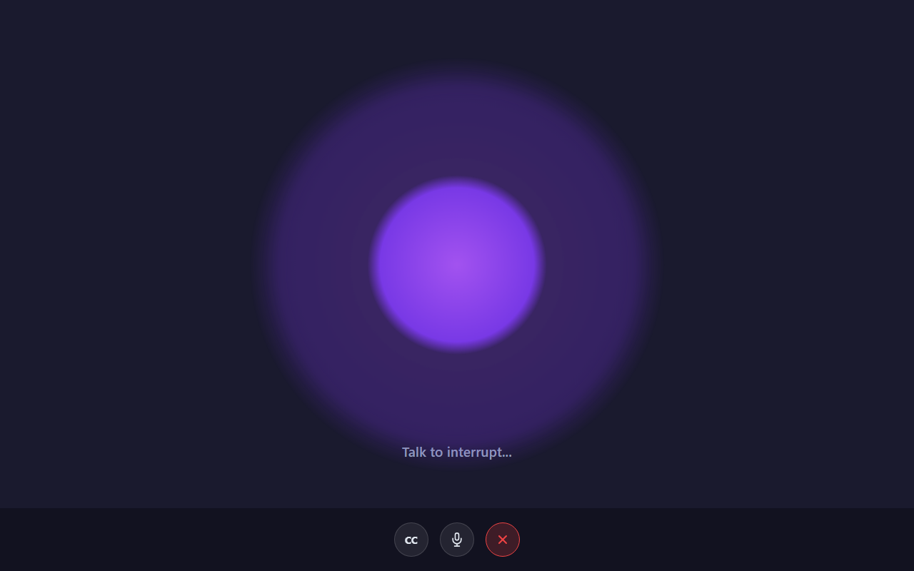
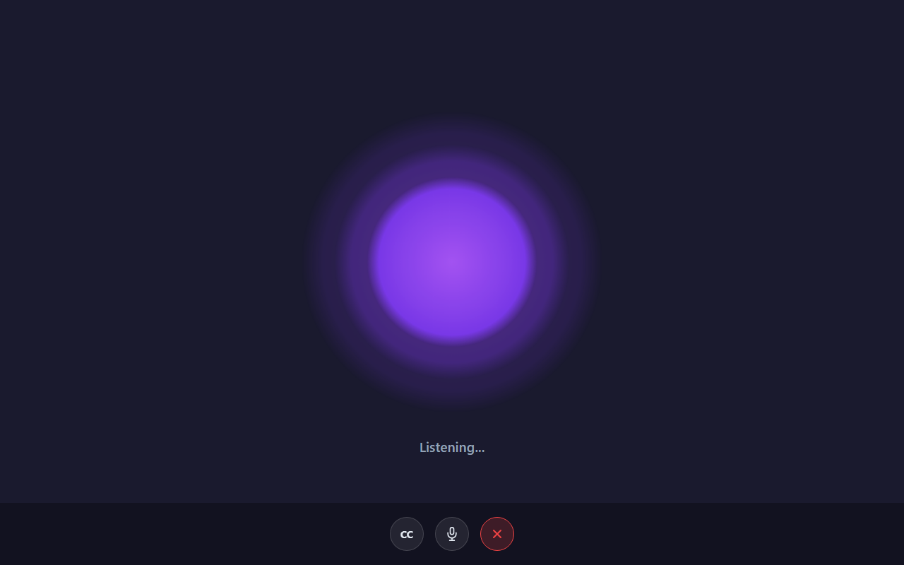

# Voice Live Web Samples

Web-based code samples for the [Azure Speech Voice Live API](https://learn.microsoft.com/azure/ai-services/speech-service/voice-live-overview) featuring a shared React frontend and language-specific backends.

## Screenshots

| Start Screen | Settings Panel | Connecting | Agent Speaking | Listening |
|:---:|:---:|:---:|:---:|:---:|
|  |  |  |  |  |

> 🎬 A video walkthrough is available at [`img/videos/voice-live-demo.webm`](img/videos/voice-live-demo.webm)

## Architecture

```
┌─────────────────────┐   WebSocket    ┌──────────────────┐   Voice Live SDK   ┌──────────────┐
│  React + Vite       │◄──────────────►│  Backend Server  │◄─────────────────►│  Azure Voice  │
│  (shared frontend)  │  JSON + PCM16  │  (Python/JS/…)   │   PCM16 + events  │  Live Service │
└─────────────────────┘                └──────────────────┘                    └──────────────┘
```

The frontend builds to static files served by the backend — no separate frontend server needed in production.

## Prerequisites

- **Node.js** 18+ and npm (for building the frontend)
- **Python** 3.9+ (for the Python backend)
- An **Azure AI Services** resource with Voice Live API access

## Authentication

**Recommended (RBAC):** Use `DefaultAzureCredential` — no API keys required.

```bash
az login   # Local development — authenticates via Azure CLI
```

For deployed environments, the `azd` infrastructure provisions a **system-assigned managed identity** with the **Cognitive Services User** role, enabling token-based auth without any keys.

**Fallback (API key):** Set `AZURE_VOICELIVE_API_KEY` in `.env` only if token-based auth is unavailable for your resource.

## Quick Start (Python)

### 1. Build the frontend

```bash
cd frontend
npm install
npm run build
```

This creates `frontend/dist/` with the static files that the backend will serve.

### 2. Set up the Python backend

```bash
cd python

# Create and activate a virtual environment
python -m venv .venv

# Activate the venv
# Windows (PowerShell):
.venv\Scripts\Activate.ps1
# Windows (cmd):
.venv\Scripts\activate.bat
# macOS / Linux:
source .venv/bin/activate

# Install dependencies
pip install -r requirements.txt
```

### 3. Configure environment variables

```bash
cp .env.sample .env
```

Edit `.env` with your credentials:

```env
# Required
AZURE_VOICELIVE_ENDPOINT=https://your-resource.cognitiveservices.azure.com/

# Authentication: DefaultAzureCredential is used by default (az login).
# Set API key below only as a fallback if token auth is unavailable.
AZURE_VOICELIVE_API_KEY=

# Connection mode: "agent" (Foundry Agent Service) or "model" (direct gpt-realtime)
VOICELIVE_MODE=agent

# Agent mode (when VOICELIVE_MODE=agent)
AZURE_VOICELIVE_AGENT_NAME=your-agent-name
AZURE_VOICELIVE_PROJECT=your-project-name

# Model mode (when VOICELIVE_MODE=model)
VOICELIVE_MODEL=gpt-realtime
VOICELIVE_VOICE=en-US-Ava:DragonHDLatestNeural
VOICELIVE_TRANSCRIBE_MODEL=gpt-4o-transcribe
```

### 4. Run the server

```bash
python app.py
```

Open **http://localhost:8000** in your browser. Click **Start session** and allow microphone access when prompted.

## Connection Modes

| Mode    | Use case | How it works |
|---------|----------|-------------|
| `agent` | Foundry Agent Service integration | Agent defines instructions, tools, and voice. Set `AZURE_VOICELIVE_AGENT_NAME` and `AZURE_VOICELIVE_PROJECT`. |
| `model` | Direct model access / BYOM | Caller configures model, voice, system prompt. Set `VOICELIVE_MODEL` and `VOICELIVE_VOICE`. |

Switch modes by setting `VOICELIVE_MODE` in `.env` or via the Settings panel in the UI.

## Project Structure

```
voicelive-samples/
├── frontend/                  # Shared React + Vite + TypeScript frontend
│   ├── public/
│   │   ├── audio-capture-worklet.js    # Mic capture AudioWorklet (24kHz PCM16)
│   │   └── audio-playback-worklet.js   # Audio playback AudioWorklet
│   └── src/
│       ├── components/        # UI components (VoiceOrb, StartScreen, etc.)
│       ├── hooks/             # React hooks (useAudioCapture, useAudioPlayback, useVoiceSession)
│       ├── types.ts           # Shared TypeScript types
│       ├── App.tsx            # Root component
│       └── main.tsx           # Entry point
├── python/                    # Python backend (FastAPI + Voice Live SDK)
│   ├── app.py                 # FastAPI server with WebSocket endpoint
│   ├── voice_handler.py       # VoiceLiveHandler — SDK bridge
│   ├── tests/                 # 85 automated tests (settings + agent mode)
│   ├── requirements.txt       # Python dependencies
│   ├── .env.sample            # Environment variable template
│   └── README.md              # Python-specific docs
├── infra/                     # Azure Bicep IaC (Container Apps + RBAC)
│   ├── main.bicep             # Entry point
│   ├── main-app.bicep         # App + Cognitive Services User role assignment
│   ├── main-infrastructure.bicep  # Log Analytics, ACR, Container Apps Env
│   └── core/host/             # Reusable modules (container-app, role-assignment)
├── deployment/                # azd hooks (predeploy image build)
├── img/                       # UX mockup reference images
├── PLAN.md                    # Project planning document
└── README.md                  # This file
```

## Deployment (Azure Developer CLI)

```bash
azd auth login
azd up
```

This provisions:
- **Container Apps Environment** with Log Analytics
- **Container Registry** (managed identity pull, no admin credentials)
- **Container App** with system-assigned managed identity
- **RBAC role assignment** — Cognitive Services User for token-based auth
- API key is optional — only injected as a Container App secret if provided

## Development

For local development with hot-reload on both frontend and backend:

**Terminal 1 — Frontend dev server** (with proxy to backend):
```bash
cd frontend
npm run dev
```

**Terminal 2 — Python backend**:
```bash
cd python
.venv\Scripts\Activate.ps1   # or source .venv/bin/activate
python app.py
```

The Vite dev server at `http://localhost:5173` proxies WebSocket and API calls to `http://localhost:8000`.

## WebSocket Protocol

The frontend and backend communicate over WebSocket at `/ws/{clientId}`.

| Direction | Message | Description |
|-----------|---------|-------------|
| Client → Server | `start_session` | Begin voice session with config |
| Client → Server | `audio_chunk` | Base64 PCM16 mic audio (24kHz, mono) |
| Client → Server | `interrupt` | Cancel current agent response |
| Client → Server | `stop_session` | End the session |
| Server → Client | `session_started` | Session ready, includes config |
| Server → Client | `audio_data` | Base64 PCM16 agent audio response |
| Server → Client | `transcript` | User or assistant transcript text |
| Server → Client | `status` | State change (listening/thinking/speaking) |
| Server → Client | `stop_playback` | Stop audio playback (barge-in) |
| Server → Client | `session_stopped` | Session ended |
| Server → Client | `error` | Error message |

## License

MIT
